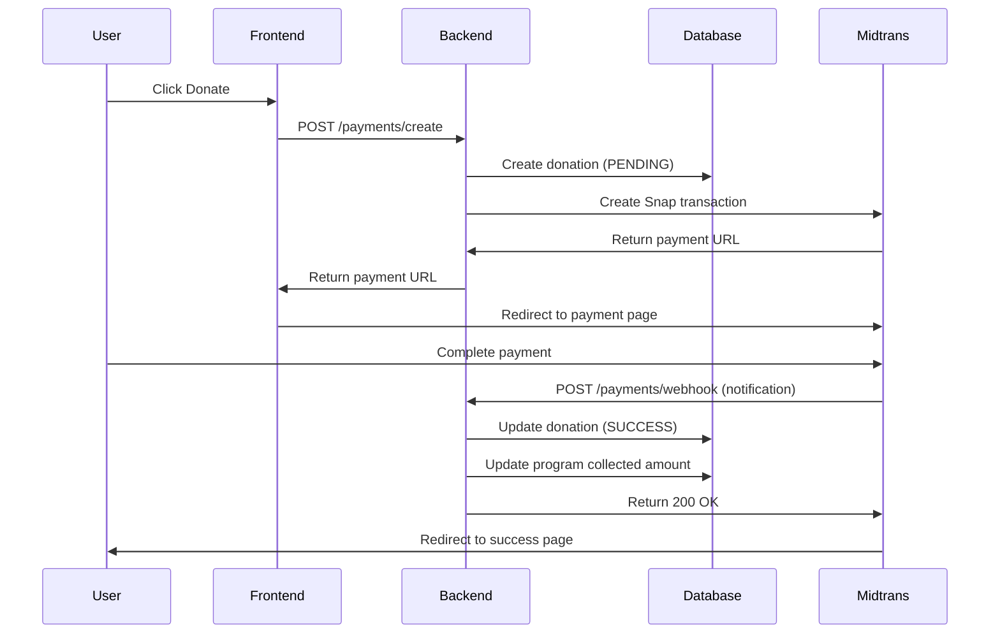

# 🎯 Setup Midtrans Sandbox (Payment Gateway)

Platform ini menggunakan **Midtrans Snap** sebagai payment gateway. Midtrans menyediakan **Sandbox Mode GRATIS** untuk testing tanpa perlu verifikasi bisnis atau biaya apapun.

---

## 📋 Langkah-Langkah Setup

### 1. Daftar Akun Midtrans Sandbox

1. Buka: **https://dashboard.sandbox.midtrans.com/register**
2. Isi form pendaftaran:
   - Email aktif
   - Password (min 8 karakter)
   - Phone number
3. Verify email Anda
4. Login ke dashboard sandbox

### 2. Dapatkan API Credentials

Setelah login ke Midtrans Sandbox Dashboard:

1. Klik menu **Settings** (⚙️) di sidebar kiri
2. Pilih **Access Keys**
3. Anda akan melihat:
   - **Server Key** → `<YOUR_MIDTRANS_SERVER_KEY>`
   - **Client Key** → `<YOUR_MIDTRANS_CLIENT_KEY>`
   - **Merchant ID** → `G123456789`

> ⚠️ **PENTING**: Jangan share Server Key ke public/frontend!

### 3. Update Environment Variables

Buka file `backend/.env` dan update dengan credentials Anda:

```env
# MIDTRANS PAYMENT GATEWAY (SANDBOX)
MIDTRANS_SERVER_KEY="<YOUR_MIDTRANS_SERVER_KEY>_ACTUAL_SERVER_KEY"
MIDTRANS_CLIENT_KEY="<YOUR_MIDTRANS_CLIENT_KEY>_ACTUAL_CLIENT_KEY"
MIDTRANS_IS_PRODUCTION=false
MIDTRANS_MERCHANT_ID="G123456789"
```

**Contoh nyata:**
```env
MIDTRANS_SERVER_KEY="<YOUR_MIDTRANS_SERVER_KEY>"
MIDTRANS_CLIENT_KEY="<YOUR_MIDTRANS_CLIENT_KEY>"
MIDTRANS_IS_PRODUCTION=false
MIDTRANS_MERCHANT_ID="G891234567"
```

### 4. Restart Backend Server

Setelah update `.env`, restart backend:

```bash
cd backend
npm run start:dev
```

---

## 🧪 Testing Payment

### Kartu Kredit Test (Sandbox)

Gunakan kartu test berikut untuk simulasi pembayaran:

| Card Number         | CVV | Exp Date | 3D Secure | Result  |
|---------------------|-----|----------|-----------|---------|
| 4811 1111 1111 1114 | 123 | 01/25    | 112233    | Success |
| 4911 1111 1111 1113 | 123 | 01/25    | 112233    | Denied  |

### GoPay Test

- Nomor HP: **081234567890**
- OTP: **123456**

### BCA VA Test

- Nomor VA akan otomatis generate
- Status langsung "paid" di sandbox

### Simulasi Pembayaran Manual

Anda bisa langsung approve pembayaran dari Midtrans Dashboard:

1. Masuk ke **Transactions** menu
2. Cari transaction berdasarkan Order ID
3. Klik **Actions** → **Change Status**
4. Pilih **settlement** (sukses) atau **cancel**

---

## 🔔 Webhook Configuration

Midtrans akan mengirim notifikasi ke backend saat status pembayaran berubah.

### Setup Webhook URL di Midtrans Dashboard:

1. Buka **Settings** → **Configuration**
2. Di bagian **Notification URL**, masukkan:
   ```
   https://your-backend-url.com/payments/webhook
   ```
3. Untuk testing lokal, gunakan **ngrok**:
   ```bash
   ngrok http 3001
   ```
   Lalu masukkan URL ngrok: `https://abc123.ngrok.io/payments/webhook`

---

## 📊 Transaction Flow



---

## 🔍 Monitoring Transactions

### Cek Status Payment di Midtrans Dashboard:

1. Login ke https://dashboard.sandbox.midtrans.com
2. Menu **Transactions** → **All Transactions**
3. Filter berdasarkan:
   - Status (pending, settlement, expire, etc)
   - Date range
   - Payment method

### Cek Logs di Backend:

Backend akan print detailed logs:

```bash
✅ Midtrans Snap transaction created: { orderId, token, url }
📩 Midtrans Notification received: { order_id, status, ... }
🔄 Updating donation xyz to status: SUCCESS
💰 Program ABC collected amount increased by 50000
🏆 Leaderboard updated for John Doe: DERMAWAN
✅ Notification processed successfully: xyz
```

---

## 🚀 Production Deployment

Ketika siap production:

### 1. Daftar Akun Production

1. Buka: **https://dashboard.midtrans.com/register**
2. Lengkapi dokumen bisnis:
   - NPWP
   - Akta Pendirian
   - KTP Pengurus
3. Tunggu approval (1-3 hari kerja)

### 2. Update Production Credentials

Edit `backend/.env.production`:

```env
MIDTRANS_SERVER_KEY="YOUR_PRODUCTION_SERVER_KEY"
MIDTRANS_CLIENT_KEY="YOUR_PRODUCTION_CLIENT_KEY"
MIDTRANS_IS_PRODUCTION=true
MIDTRANS_MERCHANT_ID="YOUR_PRODUCTION_MERCHANT_ID"
```

### 3. Production Webhook URL

Update webhook URL di production dashboard ke:
```
https://yourdomain.com/api/payments/webhook
```

---

## 🛠️ Troubleshooting

### Error: "Midtrans credentials not configured"

**Solusi:**
1. Pastikan `.env` sudah diupdate dengan Server Key yang benar
2. Restart backend server
3. Server Key harus diawali dengan `<MIDTRANS_SERVER_KEY>` (sandbox) atau tanpa `SB-` (production)

### Webhook tidak dipanggil

**Solusi:**
1. Cek Notification URL sudah benar di Midtrans dashboard
2. Pastikan backend accessible dari internet (gunakan ngrok untuk testing lokal)
3. Cek firewall tidak block incoming request
4. Lihat logs di Midtrans dashboard → Settings → HTTP(S) Notification / Webhook

### Payment stuck di PENDING

**Solusi:**
1. Simulasi manual dari Midtrans dashboard (change status ke settlement)
2. Cek webhook logs di Midtrans dashboard
3. Pastikan signature verification tidak error

### Frontend redirect ke error page

**Solusi:**
1. Cek `FRONTEND_URL` di `.env` sudah benar
2. Pastikan frontend punya route `/donation/success` dan `/donation/failed`
3. Lihat network logs di browser

---

## 📚 Referensi

- **Midtrans Documentation**: https://docs.midtrans.com
- **Snap API Docs**: https://docs.midtrans.com/en/snap/overview
- **Testing Payment**: https://docs.midtrans.com/en/technical-reference/sandbox-test
- **Webhook/Notification**: https://docs.midtrans.com/en/after-payment/http-notification

---

## 💡 Tips

1. **Selalu gunakan Sandbox** untuk development dan testing
2. **Jangan commit** Server Key ke Git (sudah ada di `.gitignore`)
3. **Webhook signature** otomatis diverifikasi di backend untuk keamanan
4. **Transaction idempotency** sudah dihandle, aman dari duplicate processing
5. **Leaderboard gamification** otomatis update saat donasi sukses

---

**Happy Testing! 🎉**
